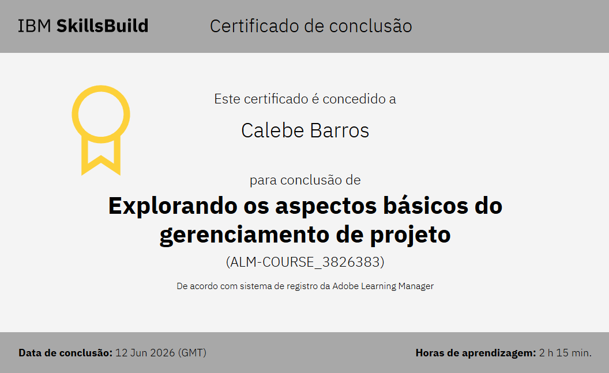
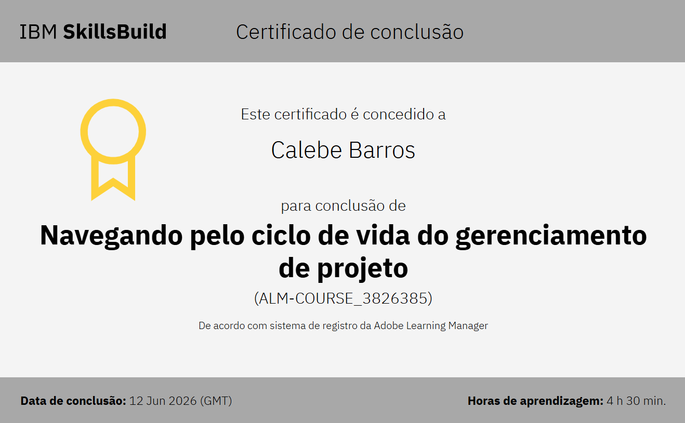

<p align="center">
  
</p>

<h1 align="center">
  👋 Olá, eu sou o Calebe 
  
</h1>

<p align="center">
💻 Estudante de Informática para Internet <br>
🎓 ETECVAV — INFONET <br>
🌐 Desenvolvedor focado em Web e Back-End
</p>

---

## 💳 Certificados

<div align="center">

<a href="https://skills.yourlearning.ibm.com/certificate/share/8b7190ea18ewogICJsZWFybmVyQ05VTSIgOiAiNzk3OTI5OFJFRyIsCiAgIm9iamVjdFR5cGUiIDogIkFDVElWSVRZIiwKICAib2JqZWN0SWQiIDogIkFMTS1DT1VSU0VfMzgyNjM4MyIKfQa1f03774df-10">
    
</a>

<a href="#">
    
</a>

<a href="#">
    
</a>

<a href="#">
    
</a>

</div>

<div align="center">

<a href="https://skills.yourlearning.ibm.com/certificate/share/9eb8ce7868ewogICJvYmplY3RUeXBlIiA6ICJBQ1RJVklUWSIsCiAgImxlYXJuZXJDTlVNIiA6ICI3OTc5Mjk4UkVHIiwKICAib2JqZWN0SWQiIDogIkFMTS1DT1VSU0VfMzgyNjM4NSIKfQbef5aa17a3-10">
    
</a>

<a href="#">
    
</a>

<a href="#">
    
</a>

<a href="#">
    
</a>

</div>


---

<h2> 🚀 Sobre Mim </h2>

```yaml
nome: Calebe Barros Ramalho da Silva
localização: São Paulo, Brasil

educação:
  [
    "Técnico em Informática para Internet - ETECVAV",
  ]

áreas_de_interesse:
  [
    "Desenvolvimento Web",
    "Back-End",
    "Banco de Dados",
    "Programação",
    "Tecnologia",
  ]

atualmente_aprendendo:
  [
    "HTML",
    "CSS",
  ]

objetivos:
  [
    "Criar projetos cada vez mais profissionais",
    "Melhorar minhas habilidades em programação",
    "Aprender novas tecnologias",
  ]

hobbies:
  [
    "Gaming",
    "Música",
    "Edição",
    "Desenvolvimento de Projetos",
  ]
```

---

<h2> 🛠️ Ferramentas e Tecnologias </h2>

<p align="left">


</p>

---

<h2> 🤝 Grupo ACDK </h2>

```yaml
grupo:
  "ACDK"

descrição:
  "Grupo acadêmico voltado para projetos, atividades e estudos do curso INFONET."

disciplinas:
  [
    "Desenvolvimento Web",
    "Banco de Dados",
    "Arte Digital",
    "Programação e Algoritmos",
  ]
```

<p align="center">
  <a href="https://github.com/ACDK-ETECVAV">
    
  </a>
</p>

---

<h2> 🐍 Snake Game </h2>

<p align="center">
  
</p>

---

<h2> 🌐 Contato </h2>

<p align="center">

<a href="https://github.com/Calebe-Barros">
  
</a>

<a href="mailto:calebebarros108@gmail.com">
  
</a>

</p>

---

<p align="center">
  
</p>
