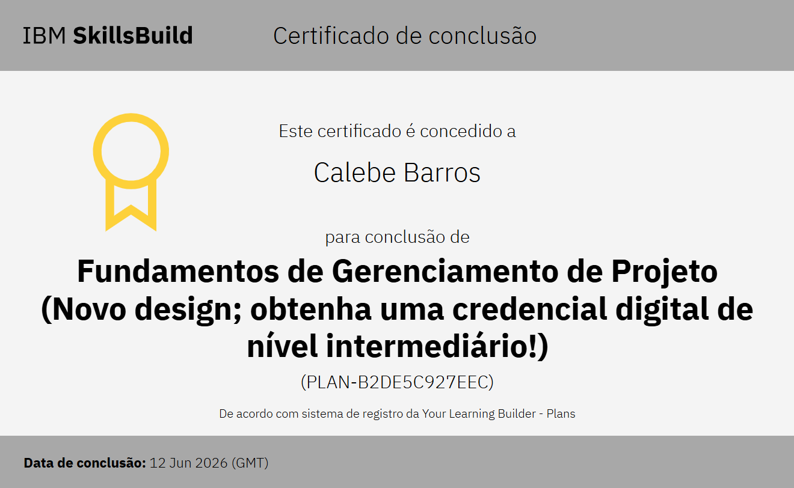
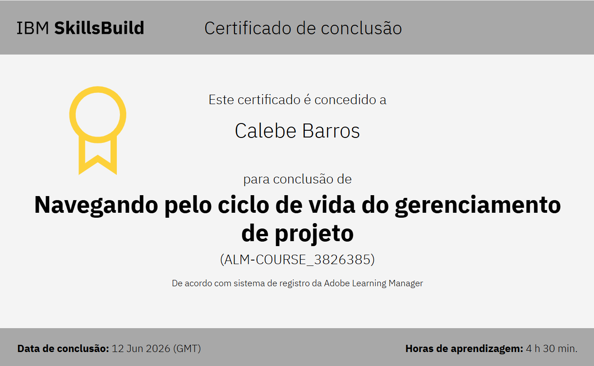

# 🗄️ Projetos de Tecnologia de Informações e Comunicações - ETECVAV


---

## 👨‍🎓 Aluno
- 👱🏻 Calebe Barros Ramalho da Silva

---

## 🎓 Instituição
**ETECVAV**  
Escola Técnica Estadual Vasco Antônio Venchiarutti  

---

## 💳 Certificado

<p align="center">
  
</p>
<p align="center">
  
</p>

🔗 [Ver certificados oficial](https://skills.yourlearning.ibm.com/certificate/share/8b7190ea18ewogICJsZWFybmVyQ05VTSIgOiAiNzk3OTI5OFJFRyIsCiAgIm9iamVjdFR5cGUiIDogIkFDVElWSVRZIiwKICAib2JqZWN0SWQiIDogIkFMTS1DT1VSU0VfMzgyNjM4MyIKfQa1f03774df-10)

🔗 [Ver certificados oficial](https://skills.yourlearning.ibm.com/certificate/share/9eb8ce7868ewogICJvYmplY3RUeXBlIiA6ICJBQ1RJVklUWSIsCiAgImxlYXJuZXJDTlVNIiA6ICI3OTc5Mjk4UkVHIiwKICAib2JqZWN0SWQiIDogIkFMTS1DT1VSU0VfMzgyNjM4NSIKfQbef5aa17a3-10)

---

## 📘 Disciplina
**Projetos de Tecnologia de Informações e Comunicações**

---

## 📌 Sobre o Repositório
Este repositório foi criado para armazenar atividades, projetos, exercícios e estudos desenvolvidos durante as aulas de PTIC.

---

## 🛠️ Ferramentas Utilizadas
- 📝 Word
- 📊 PowerPoint
- 📄 Ferramentas derivadas do Office

---

## 📂 Estrutura do Repositório
```bash
📁 atividades/
📁 projetos/
📁 modelos/
📁 estudos/
```

---

## 🚀 Objetivo
Desenvolver habilidades relacionadas à modelagem e estruturação de Projetos de Tecnologia de Informações e Comunicações, aplicando conceitos teóricos e práticos ao longo do curso.

---

## 📬 Contato
📧 **Email:** calebebarros108@gmail.com

---

## 🤝 Grupo INFONET ACDK

🔗 **Repositório do Grupo:**  
[Projeto INFONET - ETECVAV](https://github.com/ACDK-ETECVAV/ETECVAV-AULAS-1D)

📧 **Email do Grupo:**  
aleatorizando29@gmail.com
